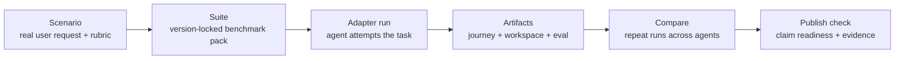

# Core Concepts

Ruhroh asks one benchmark question: did the agent deliver the intended software
outcome, and can that judgment be inspected later?

## Lifecycle

1. A `scenario` describes a realistic user request, runtime requirements, and
   evaluator rubric.
2. A `suite` freezes an ordered set of scenario ids and scenario versions for
   repeatable comparison.
3. An `adapter` connects Ruhroh to the coding agent you want to test.
4. A run preserves the implementation journey, final workspace evidence, eval
   input, eval result, transcripts, run manifest, and workspace summary.
5. `compare` aggregates repeated runs across scenarios and adapters.
6. `publish-check` decides whether the aggregate is ready to cite publicly.

## Glossary

| Term | What it owns | First command |
| --- | --- | --- |
| `scenario` | User task, assets, runtime requirements, evaluator context, rubric, evidence guidance, and calibration anchors. | `ruhroh new-scenario` |
| `suite` | Scenario membership, scenario-version locks, minimum runs, methodology, and governance notes. | `ruhroh new-suite` |
| `adapter` | The bridge from Ruhroh to the coding agent under test. | `ruhroh new-adapter` |
| `evaluator` | The terminal reviewer that inspects the final workspace and emits `ruhroh_eval_result_v1`. | `ruhroh new-evaluator` |
| `calibration` | Pass, fail, and review anchors that test evaluator behavior before repeated runs. | `ruhroh calibrate-evaluator` |
| `run plan` | The intended scenario, adapter, sample, and seed matrix for a cohort. | `ruhroh plan` |
| `artifacts` | Result JSON, manifests, eval inputs/outputs, journeys, transcripts, events, workspace summaries, and archives. | `ruhroh report` |
| `compare` | Aggregate pass rates, confidence intervals, pass@k, review queues, and claim-readiness signals. | `ruhroh compare` |
| `claim` | A suite-scoped result plus source evidence that can be validated after relocation. | `ruhroh publish-check` |

## Scenario

A scenario lives under `ruhroh/scenarios/<id>/` with a `scenario.json`,
`instruction.md`, and optional assets. The prompt should read like a real user
request. The evaluator rubric should name outcome behavior and evidence the
reviewer must inspect.

## Suite

A suite lives under `ruhroh/suites/<id>/suite.json`. It locks scenario
membership, scenario versions, minimum run counts, methodology, and governance
notes so later results can be compared against the same benchmark pack.

## Adapter

An adapter is the bridge to a coding agent. Most users should start with a
command-backed adapter created by `ruhroh new-adapter` or provided through
`RUHROH_RUN_AGENT_COMMAND`. The TypeScript adapter protocol is an advanced
extension point for tighter runtime integrations.

## Eval Agent

The eval agent runs after the implementation loop. It receives a copied final
workspace, scenario context, rubric, journey data, transcripts, and stop reason.
It returns a structured `ruhroh_eval_result_v1`; only `passed` maps to score 1.

## Artifacts

Artifacts are the audit trail. A publishable Ruhroh claim should point back to
result JSON, run manifests, run plans, eval input/output, journeys, transcripts,
workspace summaries, and workspace archives where available.

## Claim Readiness

Claim readiness is Ruhroh's publication gate. A claim is not ready just because
some runs passed. It must satisfy suite coverage, minimum run counts,
artifact-validation checks, run-plan coverage, evaluator-quality checks, and
comparability checks.
