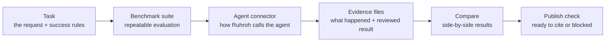

# Core Concepts

Ruhroh asks one benchmark question: did the agent deliver the intended software
outcome, and can that judgment be inspected later?

If you are new to agent evaluation, read the terms below as Ruhroh labels for
ordinary workflow pieces: a task, a set of repeated tasks, a way to call an
agent, a reviewer, saved evidence, and a final publish-or-block decision.

## Lifecycle

1. A task, stored as a `scenario`, is one realistic user request plus the rules
   for judging it.
2. A benchmark suite, stored as a `suite`, is a named group of tasks you want to run
   repeatedly.
3. An agent connector, configured with `--adapter`, is the small command or integration that lets Ruhroh call the
   coding agent you want to test.
4. A run saves the agent's attempts, the finished project, the reviewer input
   and output, transcripts, and metadata needed to reproduce the result.
5. `compare` rolls repeated runs into side-by-side results.
6. `publish-check` decides whether the result is ready to cite publicly or
   should stay blocked.

## Glossary

| Term | Plain meaning | First command |
| --- | --- | --- |
| `scenario` | Ruhroh's file name for one realistic task, the files it needs, and the rules for deciding success. | `ruhroh new-scenario` |
| `suite` | Ruhroh's file name for a repeatable benchmark suite. | `ruhroh new-suite` |
| `adapter` | Ruhroh's option name for the connector that calls a coding agent. | `ruhroh new-adapter` |
| `evaluator` | Ruhroh's file name for the reviewer command that inspects the finished project and returns pass, fail, or review. | `ruhroh new-evaluator` |
| `calibration` | Known pass/fail/review examples used to test whether the reviewer behaves sensibly. | `ruhroh calibrate-evaluator` |
| `run plan` | The checklist of tasks, agents, samples, and seeds you intended to run. | `ruhroh plan` |
| `artifacts` | Saved evidence: result JSON, transcripts, reviewer input/output, timeline, project summary, and archives. | `ruhroh report` |
| `compare` | Side-by-side results across repeated runs. | `ruhroh compare` |
| `claim` | A benchmark result plus the evidence needed for another person to verify it. | `ruhroh publish-check` |

## Task

Each task lives under `ruhroh/scenarios/<id>/` with a `scenario.json`,
`instruction.md`, and optional files. The prompt should read like a real user
request. The review rules should name the behavior that matters and the
evidence the reviewer must inspect.

## Benchmark Suite

Each benchmark suite lives under `ruhroh/suites/<id>/suite.json`. It locks which tasks
belong in the benchmark, which versions are allowed, and how many runs are
needed so later results are compared against the same benchmark suite.

## Agent Connector

An agent connector is how Ruhroh calls a coding agent. Most users should start
with a command wrapper created by `ruhroh new-adapter` or provided through
`RUHROH_RUN_AGENT_COMMAND`. Advanced users can build deeper TypeScript
integrations later.

## Reviewer Command

The reviewer command runs after the coding agent stops. It inspects a copy of
the finished project, reads the task rules and transcript, and returns
`passed`, `failed`, or `review`. Only `passed` maps to score 1.

## Evidence Files

Evidence files are what Ruhroh saves for later inspection. A publishable Ruhroh
result should point back to the result JSON, run metadata, run plan, reviewer
input/output, timeline, transcripts, project summary, and project archive where
available.

## Publication Readiness

Publication readiness is Ruhroh's final gate. A result is not ready just
because some runs passed. It must cover the expected benchmark suite, include enough
runs, keep the evidence files intact, match the run plan, pass reviewer-quality
checks, and compare like with like.
