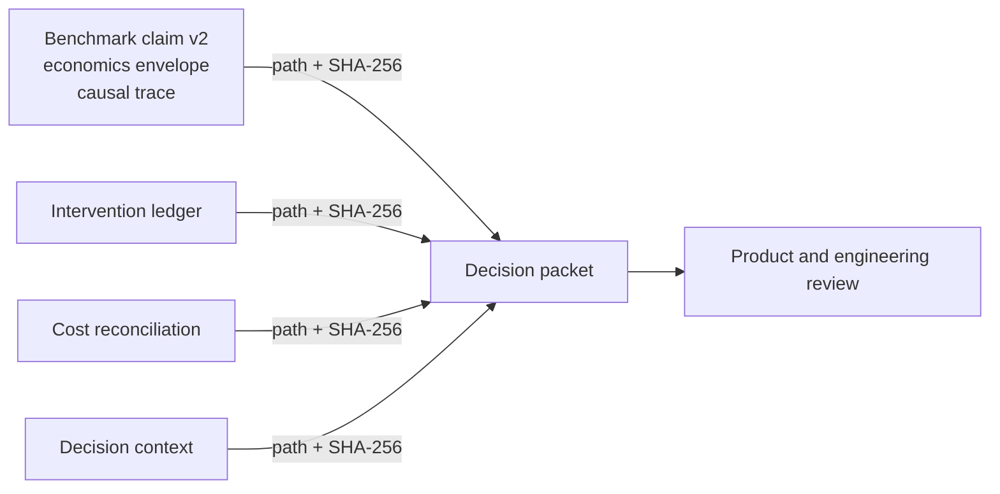

# Economics Evidence Stack

Ruhroh's economics stack answers a narrower question than “which agent is best?” It records whether a named benchmark target produced an accepted technical outcome, what implementation resources that outcome consumed, what human work surrounded it, what was billed, and which decision a responsible owner made from that evidence.

The stack is experimental. Quality-only comparisons remain valid. An incomplete economics record becomes an explicit coverage result; it does not become a precise ratio.

## Four truth planes

Each fact has one authoritative home. Derived artifacts reference that home by relative path and SHA-256 hash.

| Truth plane | Authoritative artifact | Owns |
|---|---|---|
| Technical outcome and consumption | Benchmark claim v2, economics envelope, and causal trace | Evaluator result, accepted-outcome status, implementation consumption, quality floor, containment outcome |
| Human intervention and rework | Intervention ledger | Approval, guidance, correction, execution, recovery, passive oversight, and attributable rework |
| Billed economics | Cost reconciliation | Provider-neutral billing facts, join class, allocation, currency-specific reconciliation, credits, refunds, commitments, taxes, prepaid balances, and capacity charges |
| Hypotheses, ownership, and decisions | Decision context and decision packet | Workload hypothesis, value indicator, observation window, accountable owners, readiness, and signed continue/modify/stop decision |



Do not copy raw facts between planes. A packet can project a result for a reviewer, but its durable evidence is the referenced, hashed source artifact.

## Non-negotiable evidence rules

### Target identity is not connector identity

`benchmarkTargetId` names the planned system being evaluated. `executionAdapterId` names the connector used to execute it. Aggregation uses `scenarioId + benchmarkTargetId`; connector identity is only a legacy fallback.

This matters when one connector runs several model-controlled targets. Those targets remain separate cohorts. A missing or malformed planned target can remain inspectable, but it blocks v2 publication. Model, route, or connector drift inside one target remains visible in cohort metadata and blocks comparability.

### Accepted means passed with score 1

An accepted outcome requires both `evalStatus === "passed"` and `score === 1`. Review states and ordinary failures are not accepted outcomes. Failures, retries, rework, and failed calls stay in the resource numerator unless an approved rerun-ledger infrastructure exclusion removes the run from the cohort.

### Coverage controls every ratio

Cost and token coverage are independent and use `complete`, `partial`, `unknown`, or `unavailable`.

- Partial observations remain visible as lower bounds.
- Cost per accepted outcome is absent unless every included run has complete publishable cost coverage and the accepted-outcome denominator is nonzero.
- Tokens per accepted outcome follows the same rule independently.
- Publishable cost must be billed or metered. Estimated, manual, environment-override, and legacy cost is diagnostic only.
- Currency is native. Ruhroh does not perform implicit currency conversion.

Archived v1 evidence remains readable. Its legacy usage stays unknown and cannot be upgraded into a historical economics claim.

## Runtime evidence and containment

Run-agent result v2 records explicit `delta` or `cumulative` observations. The normalizer rejects non-monotonic cumulative series and prevents exclusive leaves from being added to inclusive reconciliation checkpoints. Failed work and child-agent work remain visible exactly once.

Public traces contain numeric metadata, opaque local identifiers, hashes, relative evidence references, timing, model/route identity, and relationships. They must not contain prompts, message content, tool payloads, principal identifiers, or raw provider request IDs. A truncated final JSONL record is preserved as a partial-coverage condition; it is never silently repaired.

Resource limits are inclusive. Wall time and implementation iterations are preemptive. Token, cost, call, retry, tool, and depth limits are boundary-enforced unless a connector has passed conformance for a stronger mechanism. Unsupported required limits fail during preflight, before provider spend.

## Outcome frontier

An economics-enabled suite declares its efficiency method before the run:

- a per-scenario Wilson 95% lower-bound pass-rate floor;
- selected objectives: cost per accepted outcome, tokens per accepted outcome, and/or p95 implementation wall time;
- suitable workloads, required evidence, hidden work, and gaming risks;
- run-plan weighting and failed-work inclusion.

Only v2 suites with declared objectives calculate a frontier. Targets below the quality floor are ineligible rather than invalid. Ruhroh uses 1,000 deterministic, scenario-stratified bootstrap samples and withholds an interval when fewer than 950 samples have a valid denominator. Results distinguish Pareto, dominated, ineligible, and indeterminate points, including confidence-bound-robust dominance. The frontier never claims a universal winner.

## Analysis and decision artifacts

The scale experiment uses fresh sessions from one frozen repository baseline and prefix-nested request batches at `n = 1, 2, 4, 8, 16`. Its result is an empirical best-fit candidate plus runner-up, error, and bootstrap stability—not a complexity proof. Budget exhaustion is containment evidence.

Finding detectors cover context amplification, retry or loop amplification, unnecessary reasoning, cache misuse, rework, and unpinned model aliases. A finding is only `confirmed` when a controlled counter-case has equal quality and complete relevant coverage. A single trace can produce a candidate, not a confirmed optimization.

Provider drift compares otherwise identical cohorts against practical margins declared in the baseline. Configuration changes are `confounded`. A fingerprint change can establish identity drift; behavior alone cannot attribute a change to the provider.

Decision packets keep three claim tiers separate:

1. Technical outcome comes from evaluator evidence.
2. Autonomous deflection requires technical success and complete intervention/rework coverage with strict zero-touch execution.
3. Business value requires a typed indicator and unit, a baseline or net-new hypothesis, an observation window, an accountable owner, and external evidence.

Each tier reports a conclusion (`supported`, `not_supported`, `inconclusive`, or `not_assessed`) and an evidence level (`declared`, `measured`, or `independently_verified`). Passive observation is reported separately. The default attributable rework window is seven days. Continue, modify, and stop remain human-signed decisions.

## Programmatic command envelope

The executable CLI and other integrations share one file-I/O-free dispatcher: `runRuhrohEconomicsCommand` from `src/economics-cli.ts`. Callers read a JSON document, pass the parsed value to the dispatcher, then choose how to render or persist the JSON-compatible result.

```json
{
  "version": "ruhroh_economics_command_v1",
  "command": "conformance",
  "input": {
    "manifest": { "version": "ruhroh_adapter_manifest_v1" },
    "observations": [],
    "spans": []
  }
}
```

Supported commands are:

| Command | Input | Output |
|---|---|---|
| `validate` | Any versioned economics-stack contract | Structured support, error, and warning result |
| `conformance` | Adapter manifest plus optional observations and spans | Executable adapter conformance report |
| `scale-analyze` | Scale experiment plus observations | Scale analysis with empirical fit candidates |
| `findings` | Detector assessment inputs | Findings collection with evidence-gated statuses |
| `provider-drift` | Baseline, current controls, and current metrics | Drift or confounding report |
| `decision-packet` | Decision-packet builder input | Tiered decision packet |
| `billing-reconcile` | Source manifest, mapping, CSV/NDJSON/records, and technical facts | Currency-specific cost reconciliation |

The result is always `ruhroh_economics_command_result_v1` with `ok`, `errors`, `warnings`, and optional `output`. A domain conclusion such as `confounded`, `inconclusive`, or `review_required` is successful command execution, not a process error.

The executable reads the command input from one JSON file:

```bash
pnpm exec ruhroh economics validate ./economics-envelope.json --json
pnpm exec ruhroh economics conformance ./adapter-conformance-input.json --json
pnpm exec ruhroh economics scale-analyze ./scale-analysis-input.json --json
pnpm exec ruhroh economics findings ./finding-assessments.json --json
pnpm exec ruhroh economics provider-drift ./provider-drift-input.json --json
pnpm exec ruhroh economics decision-packet ./decision-packet-input.json --json
pnpm exec ruhroh economics billing-reconcile ./billing-reconciliation-input.json --json
```

CLI wiring should remain thin: read one envelope, dispatch once, render the returned object, and exit nonzero only when `ok` is false. The executable must not add a second interpretation layer around coverage, identity, readiness, or conformance.

## Kestrel gate

Kestrel is the first reference connector, but selection does not imply capability. Economics stays experimental until all of these gates pass:

- a sanitized structured-event fixture passes privacy checks;
- executable conformance proves the exact declared observability and enforcement capabilities;
- one live two-turn acceptance run reconciles its observations and trace;
- unsupported required budgets fail before provider execution.

Ruhroh does not infer usage by scraping a transcript. Cost is not added to the experimental smoke suite until Kestrel cost telemetry passes conformance.

## Provider-neutral billing and the FOCUS boundary

The neutral billing bridge accepts CSV, NDJSON, or iterable records. It preserves exact, bounded, allocated, ambiguous, and unmatched joins. Allocation weights must total one, and every source row reconciles in its native currency. Raw or restricted billing inputs never enter public bundles.

No FOCUS-named fields, fixtures, mappings, or exports ship in this stack. A FOCUS adapter is a separate, later contract that requires verified final FOCUS 1.5 semantics and official conformance assets. Export remains deferred until there is demonstrated demand.

## Review checklist

- Confirm every derived source reference resolves and its SHA-256 hash matches finalized bytes.
- Confirm planned benchmark-target identity exists and target cohorts were not collapsed by connector.
- Confirm accepted outcomes are evaluator passes with score 1.
- Confirm failed non-infrastructure work remains in resource numerators.
- Confirm missing or partial coverage suppresses the corresponding per-outcome ratio.
- Confirm trace privacy checks reject prompts, payloads, principals, and raw provider request IDs.
- Confirm required limits pass capability preflight before execution.
- Confirm deflection has complete intervention and rework coverage with zero disqualifying events.
- Confirm business value uses the predeclared indicator, unit, window, and owner.
- Confirm public bundles contain reconciliations and hashed references, never restricted/raw billing inputs.
